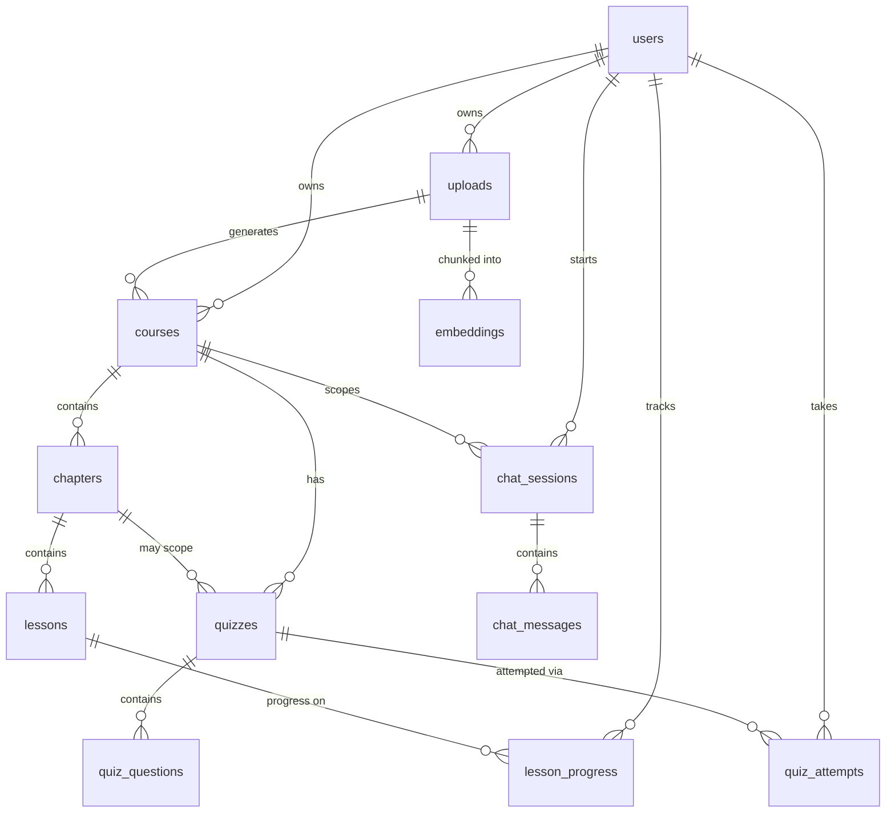

# Database

PostgreSQL schema for the PDF to E-Course Learning Platform.

- **Source of truth:** SQLAlchemy models in [`backend/app/models`](../backend/app/models) + Alembic migrations in [`backend/alembic`](../backend/alembic).
- **`schema.sql`:** a generated, human-readable snapshot of the full DDL for reference or manual provisioning.

## Applying the schema

Preferred (versioned) — run Alembic migrations:

```bash
cd backend
alembic upgrade head
```

Or apply the raw snapshot to an empty database:

```bash
psql "$DATABASE_URL" -f database/schema.sql
```

## Entity relationship diagram



## Tables

| Table | Purpose |
| --- | --- |
| `users` | Accounts (email/password + Supabase/Google OAuth), profile, flags. |
| `uploads` | Uploaded PDFs: metadata, storage location, extracted text, processing status. |
| `embeddings` | Per-chunk vector metadata (content, page, Chroma `vector_id`). Vectors live in ChromaDB. |
| `courses` | AI-generated course: title, description, objectives, prerequisites, difficulty, tags. |
| `chapters` | Ordered chapters within a course. |
| `lessons` | Ordered lessons with explanation, examples, notes, summary, key takeaways. |
| `lesson_progress` | Per-user, per-lesson completion, time spent and last position (unique per user+lesson). |
| `chat_sessions` | RAG chat conversations scoped to a course. |
| `chat_messages` | Individual chat turns with role, content and JSON `sources` (citations). |
| `quizzes` | Generated quizzes (optionally scoped to a chapter). |
| `quiz_questions` | Questions: `mcq` / `true_false` / `short_answer`, options, correct answer, explanation. |
| `quiz_attempts` | Submitted attempts with score, counts and per-question answers. |

## Notes

- All primary keys are `UUID` (`uuid4`); every table has `created_at` / `updated_at` timestamps.
- Foreign keys use `ON DELETE CASCADE`, so deleting a user or upload cleans up dependent rows.
- JSON columns (`JSONB`) store list/dict fields such as `learning_objectives`, `tags`, `options`, `sources` and quiz `answers`.
- Vector embeddings are stored in ChromaDB (persisted to disk); `embeddings` only stores the metadata needed to map chunks back to their source page.
